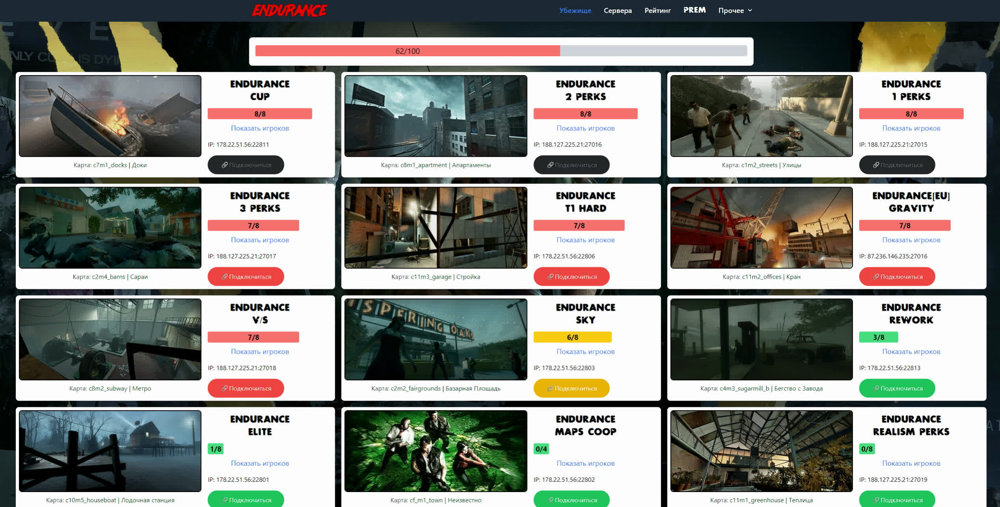
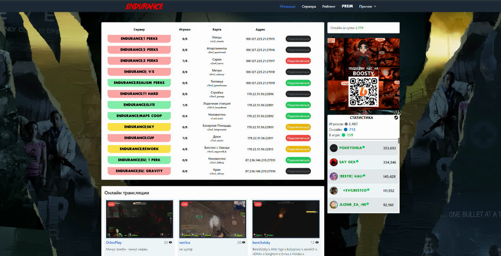
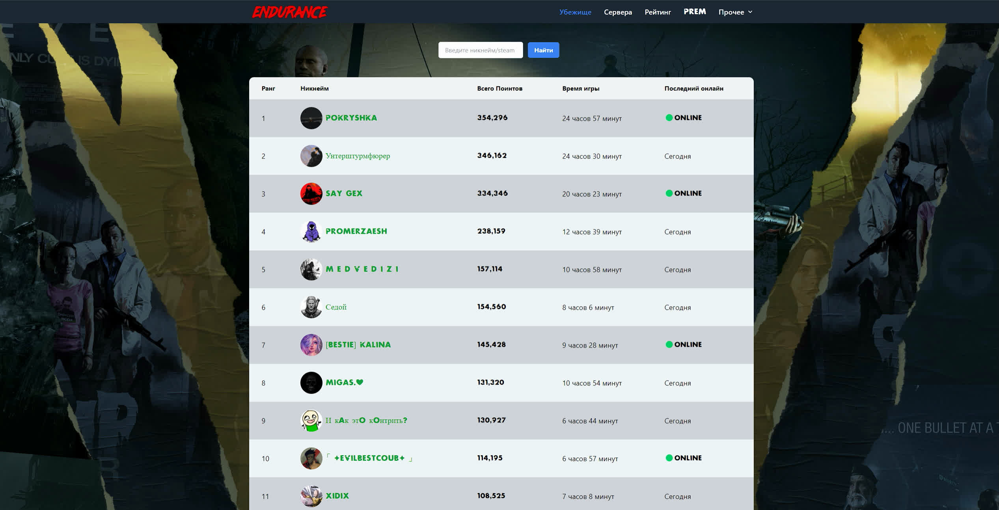
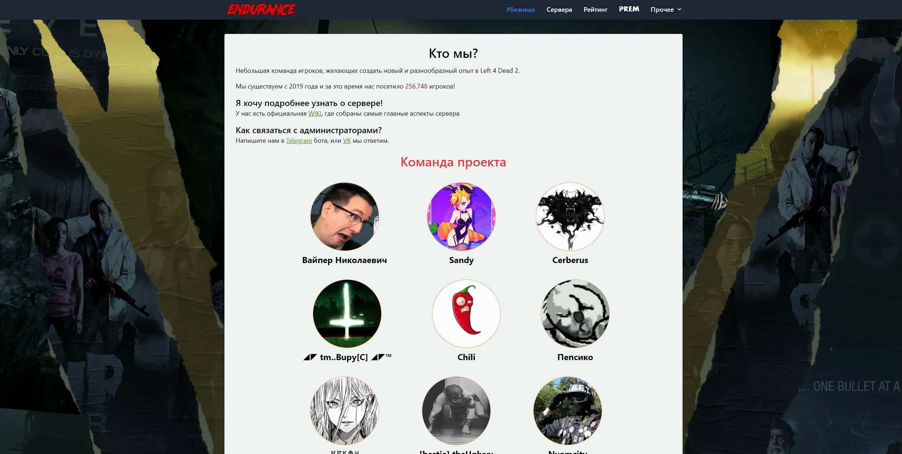
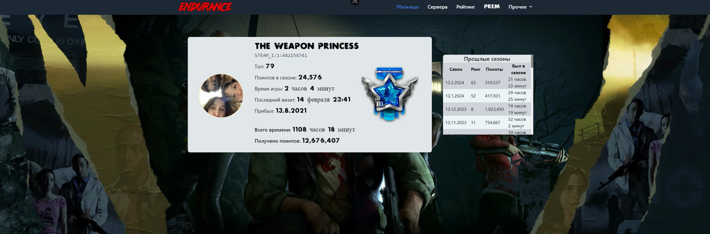

# L4D4 website

## Возможности данного проекта

#

- Автоматическое обновление информации о текущем онлайне серверов с подробными описаниями карт и общей загруженностью.

#

- Отображение числа участников группы Steam, их онлайн-статуса.

- Просмотр текущих игроков на сервере, включая информацию о их Steam-профилях.

- Трансляция стримов с платформы Twitch.

- Представление рейтинга лучших игроков сезона с возможностью поиска по SteamID или никнейму.

- Отдельная страница с привилегиями для особых игроков.

- Страница с правилами проекта, доступными на русском и английском языках.

- Информация о команде проекта и общем числе игроков, а также шкала общей загруженности серверов и количество активных игроков на каждом из них.

- Страница профилей игроков и информация о прошлых сезонах

## Что можно улучшить
- Переписать на next + react
- Подправить комментарии и код
- Добавить переключение тем